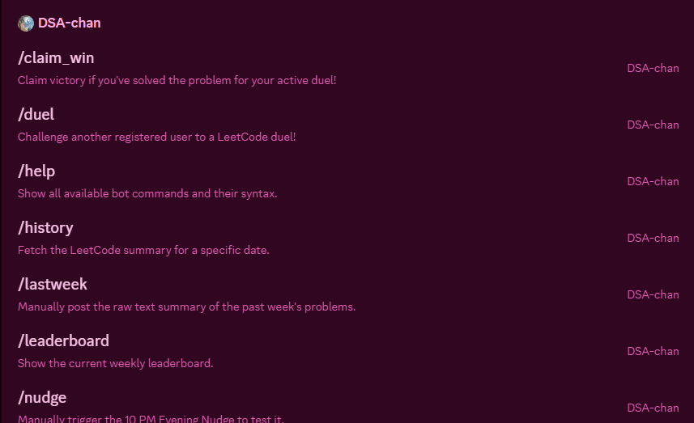
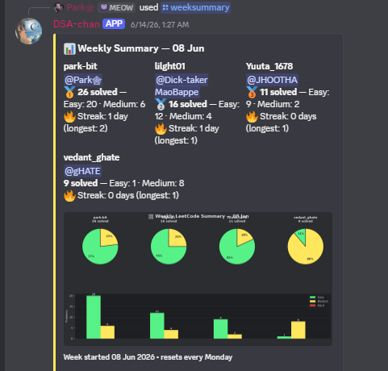
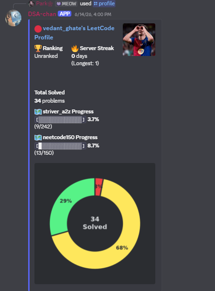
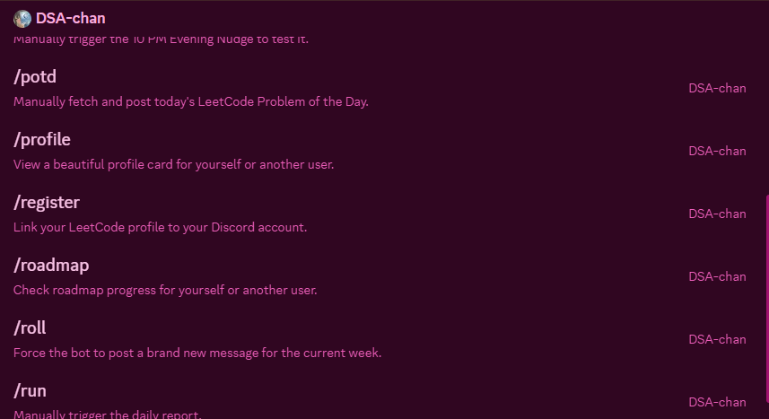
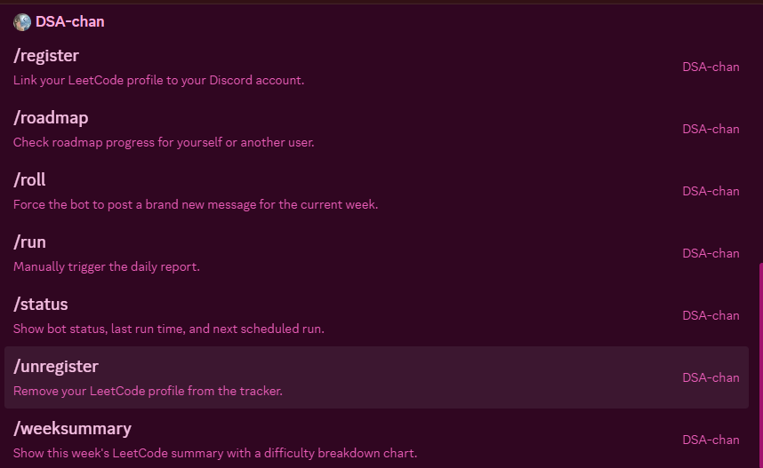

# LeetCode Discord Bot

A fully automated LeetCode tracking system for Discord servers.  
Zero manual intervention after setup — just add your profiles and let it run.
CAN BE HOSTED ON RENDER FOR FREE TIER!!

---

## ✨ Features

| Feature | Description |
|---|---|
| 📊 **Daily Reports** | Automatic midnight report with each user's solves, difficulty breakdown, and clickable problem links |
| 🔥 **Streak Tracking** | Current and longest streaks, automatically broken if a day is missed |
| 🏆 **Leaderboards** | Daily, weekly, and monthly rankings with tie-breaking by Hard → Medium → name |
| 🗺️ **Roadmap Progress** | Track completion of a curated problem roadmap (customisable) |
| 📈 **Weekly Summaries** | Weekly totals per user embedded alongside the daily report |
| ⚠️ **Inactive Detection** | Highlights users who didn't solve anything today |
| 💾 **Persistence** | All data survives restarts; corrupt files are backed up and recreated |
| 🤖 **Slash Commands** | `/status`, `/run`, `/leaderboard` |
| 🔁 **Self-healing** | Retries on LeetCode rate limits and Discord API errors with exponential backoff |
| 🆓 **Completely Free** | No cloud services, no paid APIs — runs on your own machine |

---
---
<details>
  <summary>📸 View Project Screenshots</summary>

  
  
  
  
  

</details>

## 🚀 Installation

### Prerequisites

- Python **3.11+** ([download](https://python.org/downloads/))
- A Discord bot token ([guide below](#creating-a-discord-bot))
- Internet access

### Steps

```bash
# 1. Clone or download this project
git clone https://github.com/park-bit/LeetTrack.git
cd LeetTrack

# 2. Run the one-click setup
setup.bat

# 3. Edit your credentials
code .env

# 4. Edit your user profiles
code profiles.json

# 5. Start the bot
start.bat
```

> **Note:** Everything (venv, logs, data, cache) stays inside the project folder.  
> No global installs. No admin privileges required.

---

## ⚙️ Configuration

### `.env` Variables

Copy `.env.example` to `.env` and fill in:

```dotenv
# Required
DISCORD_TOKEN=your_discord_bot_token
DISCORD_CHANNEL_ID=Copy your channel Id for storing Report using Developer Mode in DC.

# Optional (defaults shown)
TIMEZONE=Asia/Kolkata
DAILY_RUN_HOUR=0
DAILY_RUN_MINUTE=0
LOG_LEVEL=INFO
```

| Variable | Required | Default | Description |
|---|---|---|---|
| `DISCORD_TOKEN` | ✅ | — | Bot token from Discord Developer Portal |
| `DISCORD_CHANNEL_ID` | ✅ | — | Channel where reports are posted |
| `TIMEZONE` | ❌ | `Asia/Kolkata` | Your local timezone ([list](https://en.wikipedia.org/wiki/List_of_tz_database_time_zones)) |
| `DAILY_RUN_HOUR` | ❌ | `0` | Hour (0–23) to run the daily job |
| `DAILY_RUN_MINUTE` | ❌ | `0` | Minute (0–59) to run the daily job |
| `LOG_LEVEL` | ❌ | `INFO` | `DEBUG`, `INFO`, `WARNING`, or `ERROR` |

---

## 🏗️ Creating a Discord Bot

1. Go to [Discord Developer Portal](https://discord.com/developers/applications)
2. Click **New Application** → name it (e.g. "LeetCode Tracker")
3. Go to **Bot** → click **Add Bot**
4. Under **Token** → click **Copy** (paste into `.env` as `DISCORD_TOKEN`)
5. Under **Privileged Gateway Intents** → no special intents needed
6. Go to **OAuth2 → URL Generator**:
   - Scopes: `bot`, `applications.commands`
   - Bot Permissions: `Send Messages`, `Read Messages/View Channels`, `Embed Links`, `Read Message History`
7. Copy the generated URL → open in browser → add bot to your server
8. Enable **Developer Mode** in Discord Settings → right-click your channel → **Copy Channel ID** → paste as `DISCORD_CHANNEL_ID`

---

## 👥 Adding Users (Can Also be done by /register command)

Edit `profiles.json`:

```json
[
  {
    "name": "Parth",
    "leetcode_url": "https://leetcode.com/u/parth123/",
    "enabled": true
  },
  {
    "name": "Aman",
    "leetcode_url": "https://leetcode.com/u/aman_dev/",
    "enabled": true
  }
]
```

- **`name`**: Display name in Discord reports (can be anything)
- **`leetcode_url`**: Full LeetCode profile URL — supports `/u/username/` and `/username/` formats
- **`enabled`**: Set to `false` to pause tracking without removing the user

> Profiles are **reloaded every midnight** — no restart needed to pick up changes.

---

## 🗺️ Roadmap Setup

Add JSON files to the `roadmaps/` directory:

```json
{
  "two-sum": 1,
  "best-time-to-buy-and-sell-stock": 2,
  "contains-duplicate": 3
}
```

- You can create multiple files (e.g., `neetcode150.json`, `striver_a2z.json`).
- Keys are **exact LeetCode problem titles or slugs** (case-insensitive matching).
- Values are the roadmap position numbers.
- The bot auto-matches solved problems against this list using both title and slug.

The 58-problem starter roadmap included covers:
- Arrays & Hashing
- Two Pointers / Sliding Window
- Stack
- Binary Search
- Linked Lists
- Dynamic Programming

---

## ▶️ Running Locally

```batch
start.bat
```

The bot will:
1. Connect to Discord
2. Start the scheduler
3. Run the daily job every midnight in your configured timezone
4. Edit the same Discord message each day (new message every Monday)

### Manual Trigger

Use the `/run` slash command (bot owner only) to force the daily report immediately — useful for testing.

---

## 📊 Slash Commands

| Command | Description | Who |
|---|---|---|
| `/status` | Bot status, last run time, monitored users | Everyone |
| `/run` | Force-run the daily job immediately | Bot owner only |
| `/leaderboard` | Show today's and this week's leaderboards | Everyone |

---

## 🔄 Updating Users

To **add** a user: append to `profiles.json` (no restart needed — reloads at midnight)  
To **disable** a user: set `"enabled": false`  
To **remove** a user: delete their entry  

Their historical data in `data/history.json` and `data/streaks.json` will be preserved.

---

## 🐛 Troubleshooting

### Bot doesn't start

```
EnvironmentError: DISCORD_TOKEN is not set
```
→ Make sure `.env` exists and `DISCORD_TOKEN` is filled in.

### Channel not found

```
RuntimeError: Discord channel 123... not found
```
→ Ensure `DISCORD_CHANNEL_ID` is correct and the bot has access to that channel.

### No submissions appearing

- Verify the LeetCode URL in `profiles.json` is correct and public
- Check `logs/bot.log` for API errors
- LeetCode GraphQL only returns **accepted** submissions — submissions with wrong answers won't appear

### Streak is wrong

Streaks are calculated at midnight. If the bot was offline during a midnight run, the streak for that day may not have been recorded. You can `/run` manually to trigger a catch-up.

### Corrupt JSON file

If a data file becomes corrupt, the bot automatically:
1. Backs up the corrupt file with a timestamp suffix
2. Recreates it with safe defaults
3. Continues running

---

## 🏛️ Project Architecture

```
leetcode-discord-bot/
│
├── bot.py                 # Entry point, Discord client, slash commands
├── config.py              # Environment config, path constants
├── scheduler.py           # APScheduler daily/monthly job orchestration
├── formatter.py           # Discord Embed builders
├── leetcode_fetcher.py    # Async LeetCode GraphQL client
├── profile_manager.py     # Profile loading & validation
├── roadmap_manager.py     # Roadmap loading & progress computation
├── streak_manager.py      # Current/longest streak logic
├── leaderboard_manager.py # Daily/weekly/monthly leaderboard builders
├── discord_manager.py     # Discord message send/edit/retry logic
├── state_manager.py       # All persistence (atomic JSON writes)
│
├── profiles.json          # ← Edit this: your LeetCode users
├── roadmaps/              # ← Add JSON files here for your problem roadmaps
├── state.json             # Auto-managed: bot runtime state
│
├── data/
│   ├── user_stats.json    # Per-user solve counts, weekly/daily totals
│   ├── streaks.json       # Per-user streak data
│   └── history.json       # Per-user daily problem history
│
├── logs/
│   └── bot.log            # Rotating log (5 MB × 5 files)
│
├── .venv/                 # Local Python virtual environment
├── .env                   # Your secrets (git-ignored)
├── .env.example           # Template for .env
├── requirements.txt       # Python dependencies
├── setup.bat              # One-click environment setup
└── start.bat              # One-click bot launcher
```

### Data Flow

```
Midnight trigger (APScheduler)
  │
  ├─► Reload profiles.json
  ├─► Monday? → Reset weekly counters, create new Discord message
  ├─► Reset daily counters
  │
  ├─► LeetCode GraphQL API (for each user)
  │     └─► Get recent accepted submissions
  │
  ├─► Compute today's new solves (diff against known_accepted)
  ├─► Update streaks
  ├─► Accumulate weekly/monthly totals
  ├─► Compute roadmap progress
  │
  ├─► Build Discord Embeds (formatter.py)
  └─► Send or Edit Discord message → Save state
```


---

## ❓ FAQ

**Q: Does this use the official LeetCode API?**  
A: Yes — it uses the public GraphQL API at `leetcode.com/graphql`, the same one the LeetCode website uses. No scraping.

**Q: Will LeetCode ban my IP?**  
A: Very unlikely. The bot only makes a handful of requests per day (once at midnight, one request per user). It implements rate limiting, backoff, and respects 429 responses.

**Q: Can I run this 24/7?**  
A: Yes. It's lightweight — CPU usage is near zero between midnight jobs.

**Q: What if I miss a midnight run (PC off)?**  
A: Use `/run` to trigger the job manually when you come back online.

**Q: Can I add more than 3 users?**  
A: Yes — there's no limit. Just add more entries to `profiles.json`.

**Q: Can I change the roadmaps?**  
A: Yes — add or edit JSON files inside the `roadmaps/` folder. Problem matching uses both exact title and slug.

**Q: Can I change the daily run time?**  
A: Yes — set `DAILY_RUN_HOUR` and `DAILY_RUN_MINUTE` in `.env`.

**Q: Is data backed up?**  
A: All JSON files use atomic writes (write to `.tmp` then rename). Corrupt files are backed up automatically. For long-term safety, keep the `data/` folder in a backup location.

---

## 📄 License

MIT — free to use, modify, and self-host.
